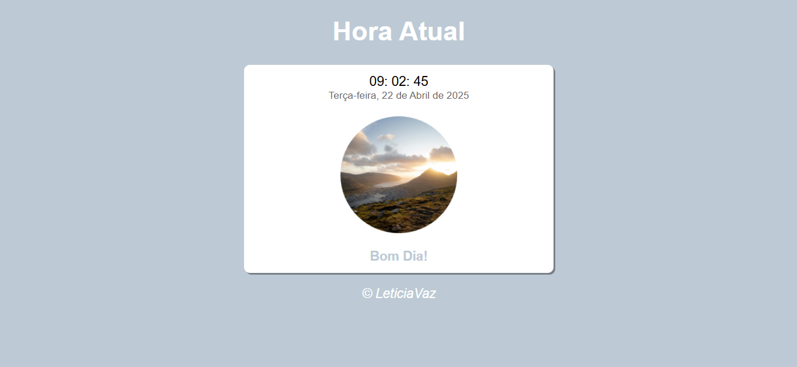
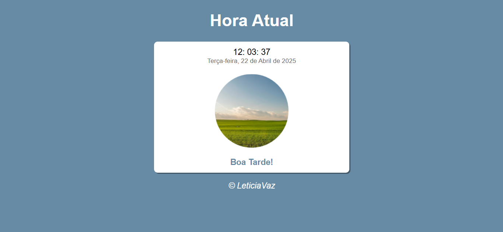
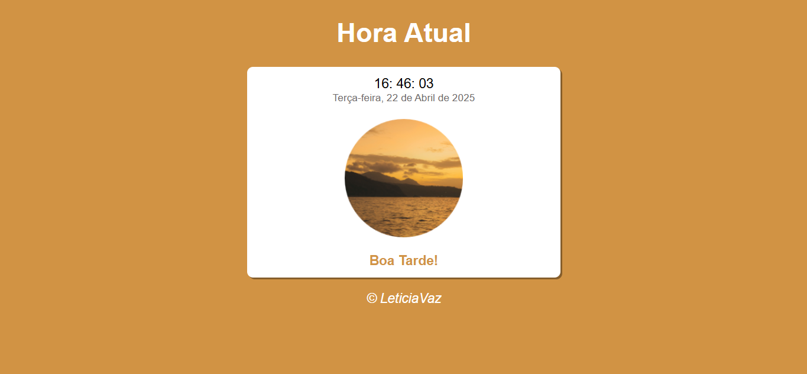
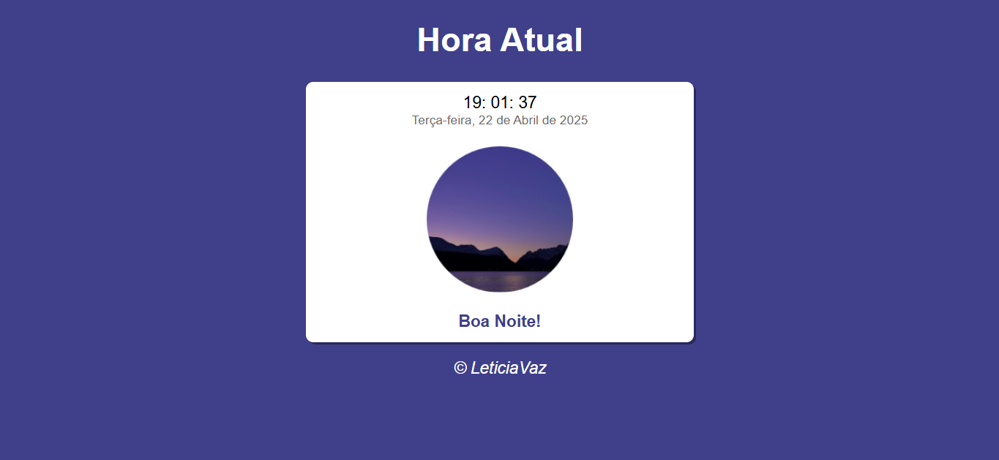
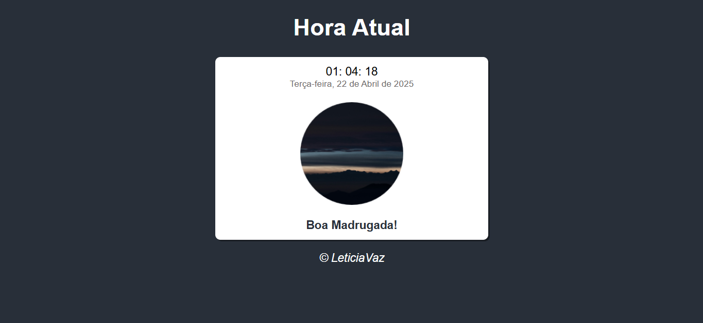

# Relógio dinamico
Relógio Dinâmico em tempo real, desenvolvido com HTML, CSS e JavaScript. 
Exibe as horas, minutos e segundos do sistema, atualizados automaticamente, além de adaptar a aparência de acordo com o horário do dia.

## 🌐Tecnologias utilizadas

- JavaScript 
- HTML 
- CSS 

### 💻Como executar o projeto

- Faça dowload do projeto em arquivo zip. 
- Extraia os conteúdos do arquivo. 
- Com o navegador, abra o arquivo index.html que está na pasta relógio

## ⚙️Principais funcionalidades

- Exibição do horário atual com atualização em tempo real.
- Mudança dinâmica de mensagem e imagem conforme o período do dia.
- Interface simples, intuitiva e responsiva.

## 📸 Demonstração

## 📌 Status do Projeto
✔️ Projeto finalizado — melhorias futuras são bem-vindas!

 
